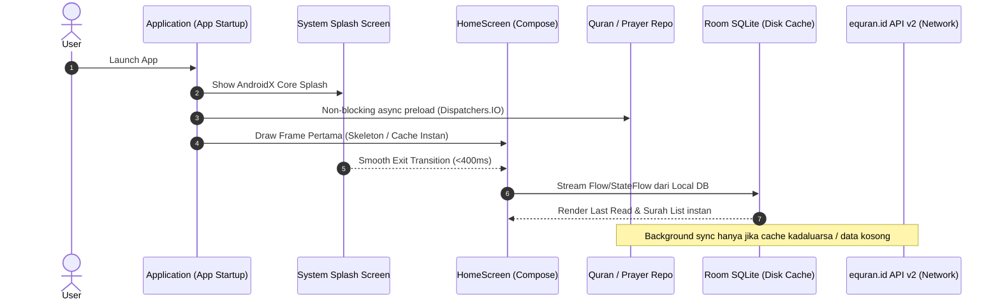

# Product Requirement Document (PRD): Al-Qur'an Pro (iOS 26 Style & Fast Startup Lifecycle)

- **Product Name:** Al-Qur'an Pro
- **Platform:** Android (Kotlin, Jetpack Compose)
- **Design Language:** iOS 26 Glassmorphism / Modern Human Interface (Clean typography, squircles, soft blur/frost cards, fluid transitions)
- **Core Architecture:** **Offline-First** (Room DB + DataStore) & **Instant Cold-Start Lifecycle**
- **Data Source:** `equran.id` API v2 (`https://equran.id/api/v2/`)

---

## 1. Tujuan Produk & Filosofi Performa
Membangun aplikasi Al-Qur'an Android yang indah bergaya iOS 26, nyaman dibaca tanpa distraksi, dan berfungsi penuh tanpa koneksi internet (offline). 

### Startup Lifecycle SLA (Fast Boot Goal):
- **Cold Start Time:** $\le 400\text{ ms}$ ke frame pertama interaktif (TTID / Time to Initial Display).
- **Time to Interactive (TTI):** $\le 600\text{ ms}$ untuk langsung bisa scroll dan klik menu.
- **Zero Blocking on Main Thread:** Database, inisialisasi network, dan caching dijalankan secara asynchronous melalui background coroutine / AndroidX App Startup.

---

## 2. Strategi Fast Startup Lifecycle & Optimasi

### Pilar Optimasi Startup:
1. **AndroidX App Startup Initialization:**
   - Menghindari inisialisasi berat di `Application.onCreate()`.
   - Menggunakan `Initializer<T>` terstruktur yang dijalankan di background thread (`Dispatchers.IO` / `Dispatchers.Default`).
2. **AndroidX Splash Screen API (API 31+ Compatible):**
   - Transisi instan tanpa custom splash activity berlebih yang membuang waktu startup.
   - `setKeepOnScreenCondition` hanya menunggu state esensial pertama (bukan menunggu network).
3. **Database Pre-seeding (Asset Bundling):**
   - Data indeks 114 Surah sudah disertakan di Room Prepack SQLite / binary JSON asset agar **first install open** tidak butuh fetch API sama sekali.
4. **Jetpack Compose Baseline Profiles & R8 Optimization:**
   - Kompilasi Ahead-Of-Time (AOT) untuk Compose runtime melalui baseline profile rules guna mengeliminasi jank saat frame pertama di-render.
5. **Deferred Dependency Injection:**
   - Komponen non-kritis (Audio ExoPlayer, Location Provider untuk jadwal sholat) di-load secara `lazy` saat fitur pertama kali diklik pengguna.

---

## 3. Fitur Utama & Struktur Antarmuka (iOS 26 Style)

### A. Halaman Home (`HomeScreen`)
1. **iOS Top Header:**
   - Tanggal Hijriyah & Masehi dinamis.
   - Indikator lokasi waktu sholat saat ini.
   - Quick Search bar dengan rounded squircle `20dp`.
2. **Hero Card (Komponen Utama Bagian Atas):**
   - **Kartu "Terakhir Dibaca" (Last Read Card):**
     - Nama surah, nomor ayat terakhir, tombol *"Lanjutkan Membaca"*.
     - Progress bar bacaan khatam Al-Qur'an.
   - **Jadwal Sholat Terdekat (Next Prayer Card):**
     - Countdown hitung mundur ke waktu sholat berikutnya (misal: *Menuju Maghrib - 00:42:15*).
     - Visual latar belakang bergradasi dinamis sesuai waktu (subuh, siang, senja, malam).
3. **Quick Menu Grid (iOS Grouped Squircles):**
   - **Al-Qur'an:** 114 Surah, 30 Juz, Tafsir, dan Bookmark.
   - **Jadwal Sholat:** 5 waktu + Imsak, Dhuha, Terbit dengan alarm adzan.
   - **Kalender Hijriyah:** Penanda hari besar Islam dan puasa sunnah (Ayyamul Bidh, Senin-Kamis).
   - **Tasbih Digital:** Counter zikir haptic bergetar halus per ketukan.
   - **Tahlil & Doa:** Bacaan Tahlil lengkap, doa arwah, istighosah, dan doa harian.
   - **Arah Kiblat:** Kompas penunjuk arah Ka'bah (offline sensor).

### B. Halaman Al-Qur'an & Detail Ayat
- **Daftar Surah:** Tab Surah, Juz, dan Penanda (Bookmark).
- **Mode Bacaan:** Mode Per Ayat (dengan terjemahan Bahasa Indonesia & tafsir per kata/ayat) serta Mode Mushaf.
- **Audio Murottal:** Floating mini player ala Apple Music di bagian bawah layar dengan qari internasional (Misyari Rasyid, Al-Ghamidi, dll) dari endpoint equran v2.
- **Offline Indicator:** Tanda centang hijau pada surah yang sudah terunduh di penyimpanan lokal.

### C. Halaman Fitur Tambahan (100% Offline Ready)
- **Tasbih Digital:** Tombol tap melingkar besar, counter target (33 / 99 / Tak Terbatas), reset button, vibrasi haptic.
- **Tahlil & Kumpulan Doa:** Struktur sekuensial (Arab, transliterasi Latin, dan terjemahan), preloaded dalam database lokal.
- **Jadwal Sholat Offline:** Menggunakan rumus perhitungan astronomi offline (PrayTimes algorithm) saat GPS/koneksi internet mati.

---

## 4. Spesifikasi Teknis & Integrasi API

### Stack Teknologi
- **Bahasa:** Kotlin
- **UI Engine:** Jetpack Compose + Compose Material 3 (dimodifikasi ke iOS HIG design)
- **Arsitektur:** Clean Architecture + MVI/MVVM
- **Local DB / Offline Engine:** Android Room Database + DataStore
- **Network Client:** Retrofit2 + Kotlinx Serialization / OkHttp Caching
- **Audio Player:** AndroidX Media3 (ExoPlayer) dengan `CacheDataSourceFactory` untuk caching audio offline.

### Endpoint API `equran.id` v2
| No | Fitur | Endpoint | Strategi Cache |
|---|---|---|---|
| 1 | Daftar Surah (1-114) | `GET /api/v2/surat` | Preloaded Asset + Room DB sync |
| 2 | Detail Surah & Ayat | `GET /api/v2/surat/{nomor}` | Room DB cache saat dibuka / download all |
| 3 | Tafsir Surah | `GET /api/v2/tafsir/{nomor}` | On-demand Room cache |

---

## 5. Roadmap Implementasi

1. **Sprint 1: Core Engine & Fast Startup Architecture**
   - Setup AndroidX App Startup, Splash API, dan Room Database pre-seeding.
   - Desain Design System Token iOS 26 (Colors, Typography Amiri/LPMQ + Inter, Squircles, Shadows).
2. **Sprint 2: Offline-First Quran Repository & API Client**
   - Entity & DAO Room untuk Surah, Ayat, Tahlil, dan Bookmark.
   - API client `equran.id` v2 dengan strategi fallback offline instan.
3. **Sprint 3: Home Screen & Hero Card**
   - Pembuatan Hero Card (Last Read & Prayer Countdown).
   - Menu Grid iOS 26 (Tahlil, Kalender, Jadwal Sholat, Tasbih).
4. **Sprint 4: Surah Reading Experience & Floating Audio Player**
   - Detail Surah, slider ukuran font, bookmark, dan floating media player.
5. **Sprint 5: Modul Tahlil, Tasbih Digital & Kompas Kiblat**
   - Modul interaktif Tasbih dengan haptic feedback dan pembaca Tahlil offline.
6. **Sprint 6: Quality Assurance & Build CI Verification**
   - Verifikasi lint, compile debug & release APK di GitHub Actions CI.
